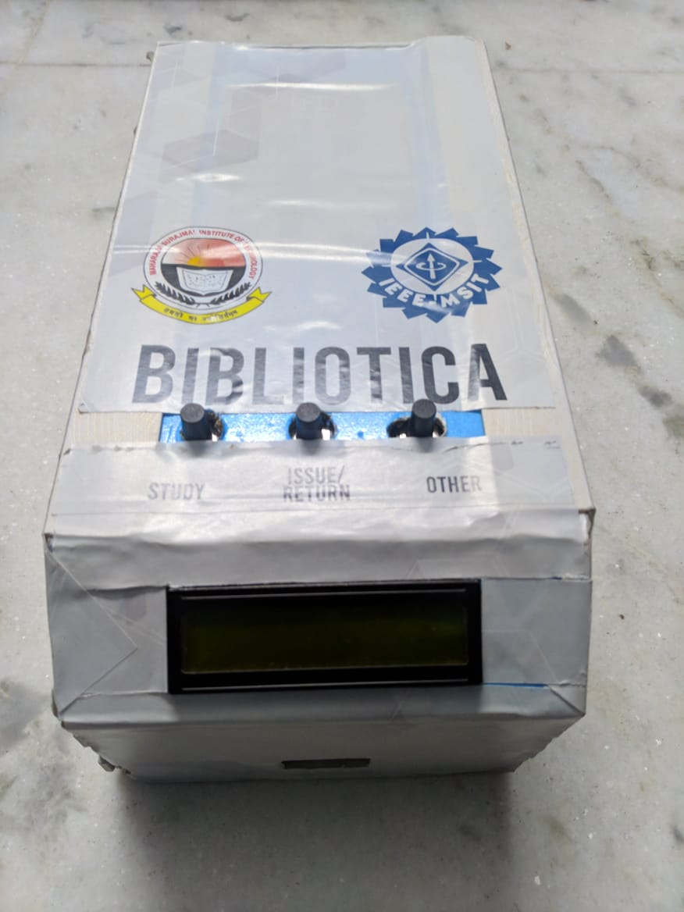
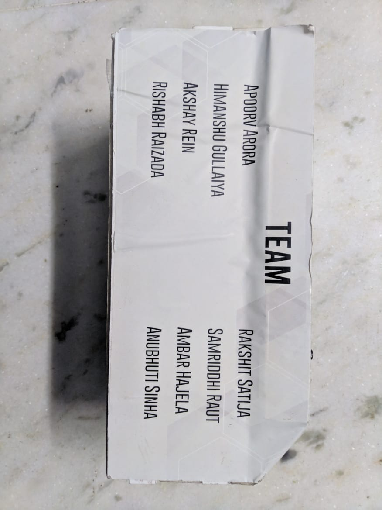
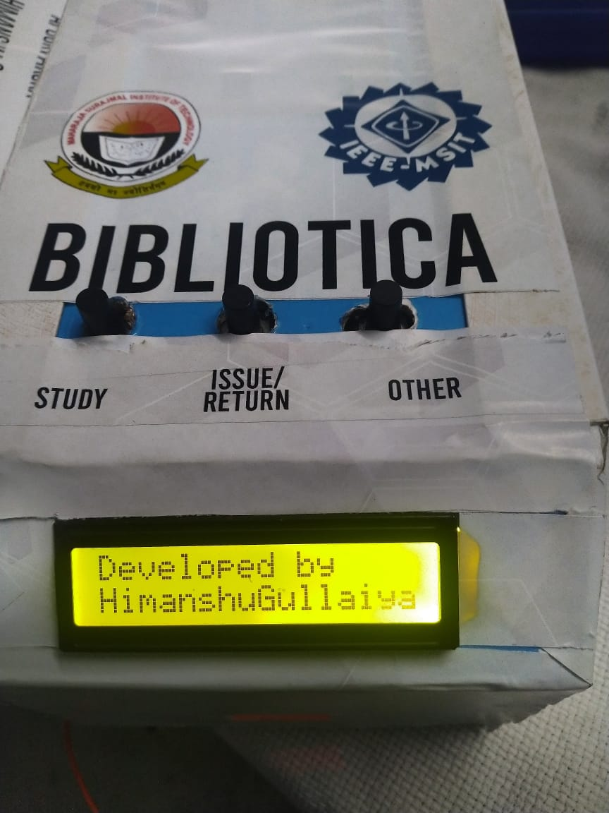
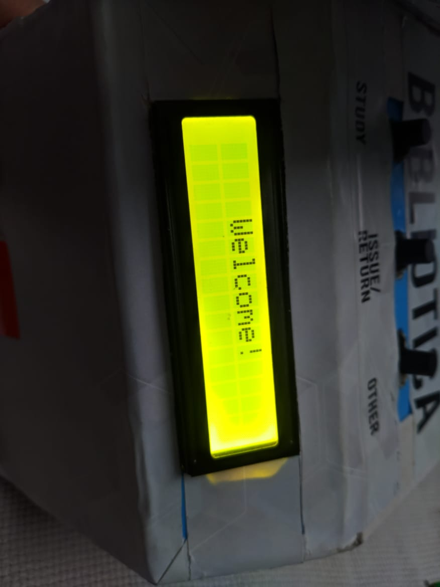
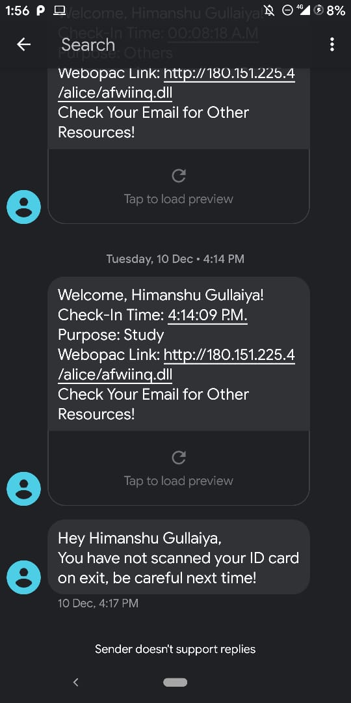

# IOT Library Automation Product
#### <em>Python Automation System implemented on <strong>Raspberry Pi 3</em></strong>

> Product Images
>
 &nbsp;  &nbsp;  &nbsp;
> Welcome

 &nbsp;
 &nbsp;
 &nbsp;

**Documentation Yet to to Completed. Stay Tuned!**
