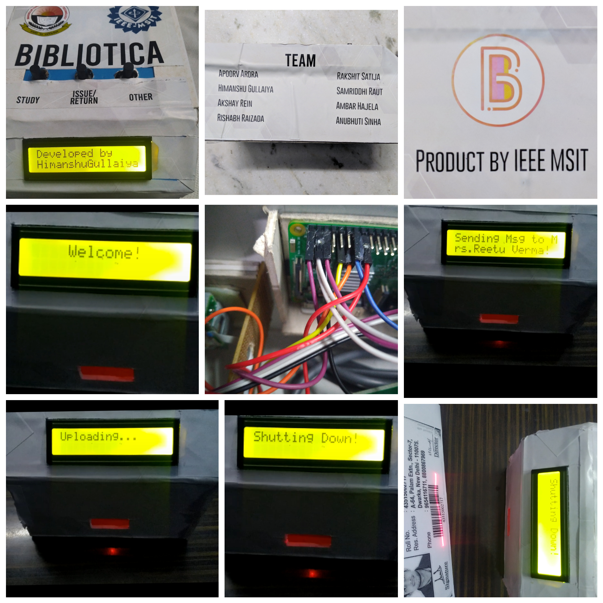
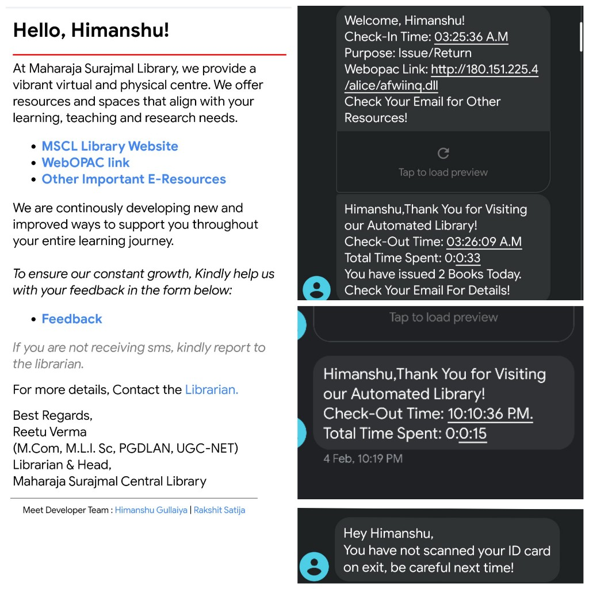
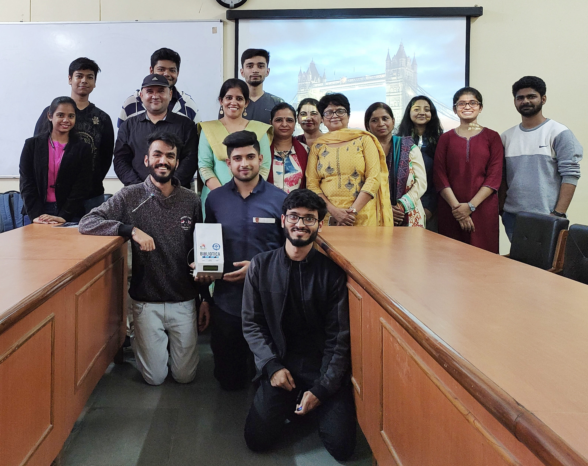
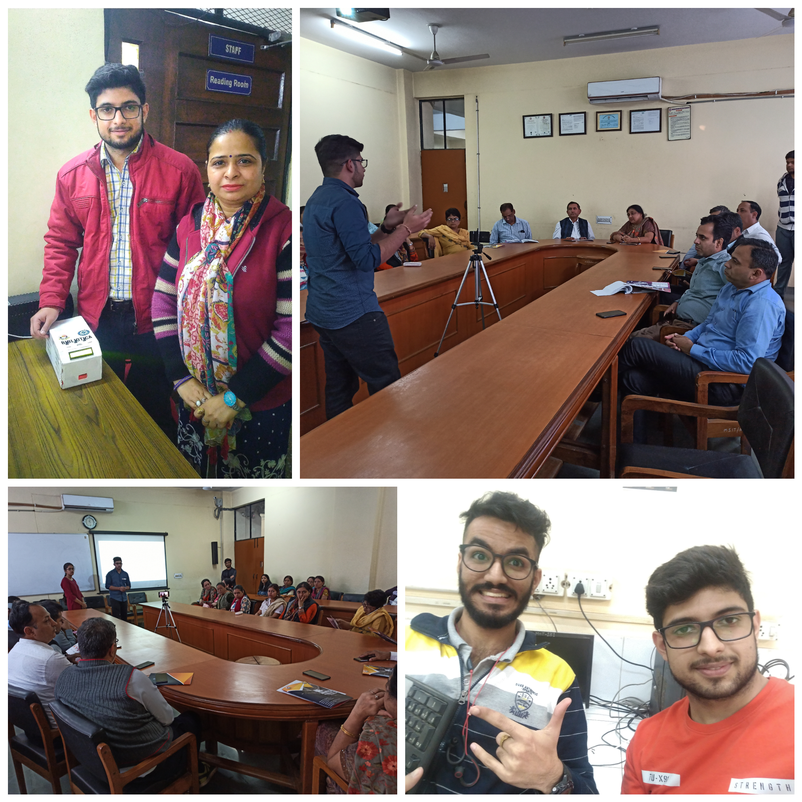

# BIBLIOTICA - A COMPLETE LIBRARY AUTOMATION SYSTEM
#### <em>Python Automation System implemented on <strong>Raspberry Pi 3</em></strong>
* Hassle-free id card barcode-scan Entry & Exit
* Log Details’ SMS sent to the user on Entry & Exit
* Email containing links of Library’s Resources & Book Server sent on Entry
* Also Maintains Books Issue & Return Record of each user.

This Project was presented in front of Deans of both MSI & MSIT and all the respected Faculty Members. 
The Product is currently Deployed in MSI & MSIT Library.

> **Product Images**

> **Sms & Email Sent to Students**

> **Team**

> **Presentation to the Director & Other Esteemed Faculty**

